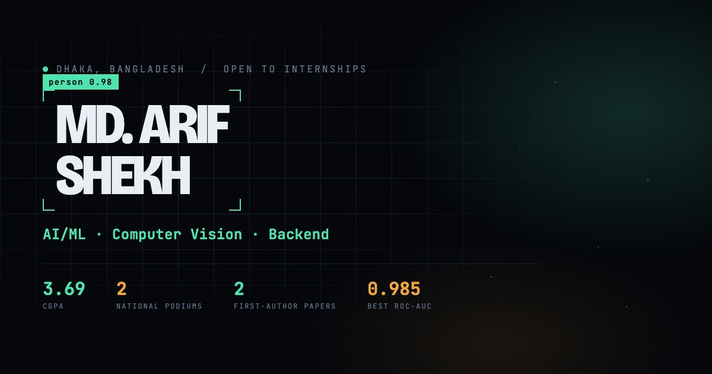

# Md. Arif Shekh — Portfolio

An immersive single-page portfolio built around one idea: the site should look
like the thing I actually work on. Every element is framed the way an object
detector frames what it has found, and the background is a latent space you fly
through as you scroll.

**Live:** https://arifshekhk8.github.io/portfolio/



---

## What is in here

| Section | What it holds |
| --- | --- |
| Hero | Name inside a detection box, a `class:` line that scrambles between roles, and four headline numbers |
| About | Bio, education record, languages |
| Work | 8 projects with the numbers that were actually measured, filterable, each opening a full case study |
| Journey | 12 dated milestones from SSC in 2019 to now |
| Skills | 5 banks of segmented level meters |
| Awards | 4 competition results, 4 participations, 6 scanned certificates in a lightbox |
| Contact | Email, profiles, references, and a form that composes a mailto |

## The design

Machine-vision telemetry. A navy-void base with mint teal for confident
signal and amber for measured values, on a scan grid under a grain plate.

- **Display:** Bricolage Grotesque
- **Prose:** Newsreader
- **Telemetry:** JetBrains Mono

The recurring motif is the detection box: four corner brackets and a class
label carrying a confidence score. It frames the name in the hero, the
headshot in About, project cards on hover, and the cursor itself, which locks
onto whatever it is pointing at.

## The 3D layer

No models, no textures, no downloaded art. All of it is generated in GLSL.

**`NeuralField`** seeds 9,000 points across 14 z-planes with heavy jitter, so
the cloud reads as stacked network layers rather than a starfield. Each point
carries its own drift phase, takes pointer parallax weighted by depth, and
recycles through a modulo on z, which is what makes the forward flight
endless. An activation pulse sweeps along z and briefly brightens whatever it
crosses. Positions come from a seeded mulberry32 generator, so the scene is
identical on every visit.

**`ScanGrid`** is a ground plane with a derivative-based anti-aliased grid and
a scan line running toward the horizon.

Scroll position and pointer position live in refs, not state, so moving the
mouse or the page never re-renders the React tree.

### Performance

Three device tiers are probed from CPU cores, device memory, pointer type and
WebGL support:

| Tier | Particles | DPR | Bloom |
| --- | --- | --- | --- |
| high | 9,000 | 1–2 | yes |
| mid | 3,800 | 1–1.5 | no |
| low | none, static gradient instead | 1 | no |

`prefers-reduced-motion` forces the low tier, skips the preloader and reveals
all content immediately. The three.js bundle sits behind a dynamic import, so
first paint costs about 85 KB gzipped rather than 345 KB, and the render loop
stops entirely when the tab goes to the background.

Content is never hidden behind JavaScript: the scroll-reveal styles are scoped
to a class React adds on mount, so if the bundle fails or stalls the page still
reads as plain content.

## Running it

```bash
npm install
npm run dev      # http://localhost:5173
npm run build    # production build into dist/
npm run preview  # serve the build
npm run lint     # oxlint
```

Pushing to `main` builds and publishes to GitHub Pages through
[`.github/workflows/deploy.yml`](.github/workflows/deploy.yml). The Vite base
path switches to `/portfolio/` when `DEPLOY_TARGET=gh-pages`, so local dev and
the deployed site both work without editing anything.

## Layout

```
src/
  data/        every piece of content: profile, projects, skills, journey, achievements
  sections/    Hero, About, Work, Journey, Skills, Awards, Contact, Footer
  components/
    canvas/    Experience, NeuralField, ScanGrid, Effects
    ui/        Nav, Cursor, Preloader, DetectionBox, ProjectCard, CaseStudy, Lightbox
  hooks/       useScrollProgress, usePointer, useReveal, useScrollSpy, useScramble
  styles/      tokens, reset, base, motifs, and one file per section
  utils/       device tier probe
public/
  certificates/  six certificate scans as WebP previews plus the original PDFs
```

Content lives entirely in `src/data`. Adding a project means adding an object
to `projects.js`; nothing in the components needs touching.

## Built with

React 19 · Three.js · React Three Fiber · postprocessing · Vite 8 · Sass ·
lucide-react · oxlint

## Contact

- Email: [shekharif409@gmail.com](mailto:shekharif409@gmail.com)
- GitHub: [@arifshekhk8](https://github.com/arifshekhk8)
- LinkedIn: [arif-shekh](https://www.linkedin.com/in/arif-shekh/)
- Kaggle: [@arifshekh](https://www.kaggle.com/arifshekh)
